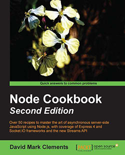

# Node cookbook



---

# Table of Contents

* [Ch1 - Making a Web Server](./ch1-making-a-web-server)

(Completion **9%** / 100%)

Not completed:

* [Ch1 - Making a Web Server]()
* [Ch2 - Exploring the HTTP Object]()
* [Ch3 - Working with Data Serialization]()
* [Ch4 - Interfacing with Databases]()
* [Ch5 - Employing Streams]()
* [Ch6 - Going Real Time]()
* [Ch7 - Accelerating Development with Express]()
* [Ch8 - Implementing Security, Encryption, and Authentication]()
* [Ch9 - Integrating Network Paradigms]()
* [Ch10 - Writing Your Own Node Modules]()
* [Ch11 - Taking It Live]()

---

# Requirement

In order to fast install, I offer command is easy to copy and paste.

For windows:

```sh
npm install -g typescript
npm install -g typings
npm install -g supervisor
npm install -g concurrently
```

For linux:
```sh
sudo npm install -g typescript
sudo npm install -g typings
sudo npm install -g supervisor
sudo npm install -g concurrently
```
